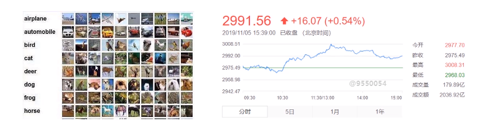

Facebook人工智能研究员(FAIR)于2017年在Github上开源。PyTorch前身是torch，torch之前并非是主流语言编写，基于主流语言与受众群体，factbook采用了python对torch框架进行重构，但pytorch底层也用到了c/c++但其提供了python的接口，因此可以很便利的用python调整整个框架，来完成深度学习的模型搭建，并利用这些模型来解决实际问题。


# PyTorch与TensorFlow比较

| **Pytorch**                                                  | **TensorFlow**                                               |
| ------------------------------------------------------------ | ------------------------------------------------------------ |
| 简洁（编程同Python几乎一致） <br>动态计算<br>visdom<br>部署不方便 | 接口复杂 <br/>静态图（TF2.0 Eager Execution已引入动态图）<br/>Tensorboard (现阶段PyTorch也引入了) <br/>部署方便(TF serving)<br/> |

> Pytorch如果要做部署，需要用到Python的flask等来完成部，现在有fastAPI
>
> TensorFlow的TF serving直接完成部署，在资源调度上更好一些，在模型部署时比较好。
>
> 建议时间足够的话，两者都学习


# 静态图与动态图

**什么是动态图与静态图**

- 动态图: 编好程序即可执行，

- 静态图: 先搭建计算图，后运行，允许编译器进行优化


**torch编程: 编程与调试都比较简单**

```python
import torch
A = torch.Tensor([0])
B = torch.Tensor([10])
while(A<B)[O]:
   A += 2
   B+=1
   print(A)
   print(B)
```

**TensorFlow编程:**  **静态图在编译时，可以被编译器进行一些优化操作; 代码编译复杂，调试不直观。**

```python
import tensorflow as tf
A = tf.constant(0)
B = tf.constant(10)
def cond(A, B,*args):
    return A < B

def body(A, B)
	A = tf.add(A, 2)
	B = tf.add(B 1)
	return A, B

c1, c2 = tf.while_loop(cond, body,[A,B])

with tf.Session() as sess:
	A res, B res = sess.run([c1, c2])

print(A res)
print(B res)
```


# 安装与搭建PyTorch的环境

笔者的文章：[Python+PyTorch+Anaconda安装配置](https://juejin.cn/post/7290494120207319092)


# 机器学习的基础

## 分类与回归问题

机器学习要解决的问题，主要还是围绕的“**分类与回归**”两大问题来展开。

- 图像识别：大部分会归为分类任务
- 目标检测:  找到图片中的位置，同时找到类别，即属于分类问题与属于回归问题


**如何判断是分类问题还是回归问题**



**分类任务是指用离散的值来描述的任务**，如上左图，一共有10分类别，对应有10维禹量。假如某分图片的10维向量为：`[0.1,0.1,0.10.1,0,0,0,0.5,0.1,0]` , 其中**0.5**的概率最大，而0.5在该向量中位于第8的位置，那说明该图像的分类为"dog"。 总之：我们预测10类别，对应有总和为1的10维向量，我们就称为该向量为10维向量,其中每个向量的索引值即为类别的编号。 同量，如果我们要预测1000个类别，则输入为1000维向量，同样索引位置即为类别编号,  总和为1。


**与分类任务相对的则是回归任务，输出为连续值，而不是离散值**，如上右图，是一个股票价格的预测、房价的预测、身高的预测等，解决连续值的预测。因此我们可以这么定义回归任务：如果我们网络或采用机器学习的模型最终输出的是一个连续值，那称之为回归任务。


## 机器学习问题的构成元素 

机器学习围绕 **样本、模型、训练、测试、推理** 这五个元素开展工作。

### 样本

样本是获取知识的依据。对于机器学习问题而言，并不是进行盲目的进行推理，一般是根据已知的内容来抽取出一个客观的规律，再根据规律进行推理与预测。这些规律就是从样本挖掘而出，对应的机器学习中的 **学习**

样本包括以下两样内容：

- 属性：描述样本本身的性质
- 标签：样本的类别，可以是离散和也可以是连续的

可以用`y = f(x)`函数来表示属性与样本之间的关系，其中x为属性，y为标签。标签是由属性归纳总结而来。

### 模型

有了样本（x,y) 之后，就可以用模型来将规律挖出，模型就对应`y =f(x)`函数中的`f`，即`f`为函数关系，通过挖掘样本属性之间的内在联系，来得到样本的标签。模型的公式：`f(x) = wx + b`

### 训练

学习这个模型的过程，就是所谓的训练过程。也就是求解w,b过程，其中w和b称为参数。

>  求解参数的方法很多，用PyTorch主要是用深度学习的方式来实现。即通过训练，能够求解出模型中的参数。


### 测试

通过训练，能够求解出模型中的参数。训练得到参数后，就可以对当前的模型进行测试与评估。我们通过机器学习的方法计算出的一组参数，我们认为这组参数是最优的，但到底有多好，是否还有其他方法求解出来的参数是否比之训练得到的模型参数最终预测结果会更好呢？这个时候我们会通过一套测试方法来完成。总之通过测试我们能够完成对模型性能的评估。

分类：ROC曲线

评价：PR曲线进行评价

> **PR 曲线**是一种用于评估二分类模型性能的可视化工具。它以查准率为纵轴，召回率为横轴绘制曲线。
>
> **ROC曲线**全称是"Receiver Operating Characteristic"曲线，被广泛用于评价分类器的性能。


### 推理

如果性能OK,，则就有了`f(x)`函数, 其中`f`为训练后的模型。现拿到一组样本，该样本只有属性没有标签，我们利于`f(x)`函数，对该样本进行推理，获取标签。利于学习所得的模型来获取样本标签的过程称为推理。


# PyTorch的基本概念


(待续)


