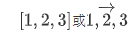
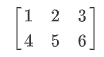
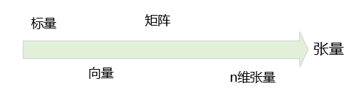
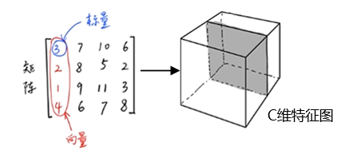
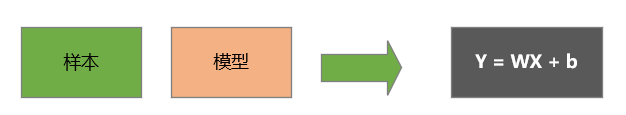
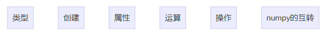
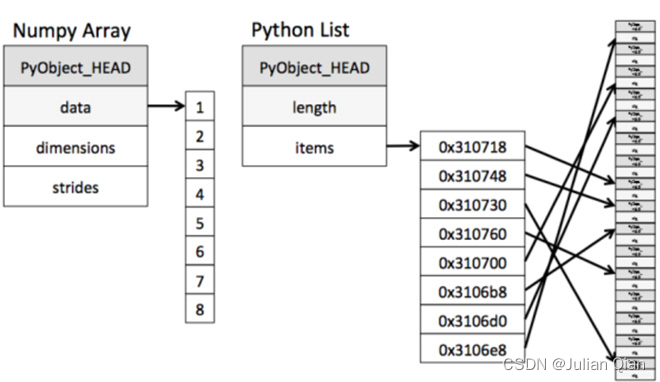
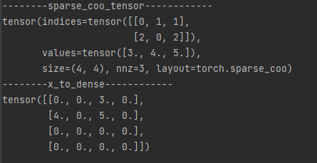

## Tensor的理解

数学中有标量、向量和矩阵的概念，它们的维度分别是0、1、2。其中：

- **标量**可以看成的一个数字，**`1`**，标量中元素的位置固定。

- **向量**可以看成是一维表格，向量中元素的位置需要通过其索引确定，表示为

  

- **短阵**可以看成是二维表格，矩阵中的元素位置需要通过其行号和列号确定，表示为

  


**张量(Tensor) 可以视为矩阵的扩展，可以用于表示无穷维度的数据**

如果我们用标量、向量或矩阵描述一个事物时，该事物最多可用 [H,W]的维度表示。在现实与客观世界中，我们经常会碰到的物体的维度可能会更高维度，很难通过向量或矩阵来描述，这时我们就需要**张量**。也就是说，我们可以通过张量来描述任意维度的物体 `H * W * C`，其中C为C维的特征图（特征图是深度学习中的一个概念），除外我们还可以用**Tensor**描述更高维度的物体：`H * W * C* D`，其中D为未知的更高维空间。


总之，张量是对于标量、向量、矩阵之上进行更加泛化的定义。标量可以看成是0阶的张量，向量是1阶段张量，矩阵是2阶的张量，除了0,1,2阶的张量之外，还有`3阶、4阶、5阶..n阶`的张量。引申到**深度学习**，其 数据输入的维度是不确定的（可以是任意维度），这时就需要采用一个更加广泛的概念去描述这些量，Tensor就可以更便利解决该问题的。


## Tensor的基本概念



其中标量是0维的张量，向量是1维的张量，矩阵是2维的张量。


举例：如下所示，左侧为一个长方体某一切面的矩阵（二阶张量），该矩阵包含N*M个元素，其中每一个元素是一个标量，每一张都是一个向量。一个物体有N个切面，将C 个 N * M 拼接到一起，就会得到一个三阶的张量`C*N*M`用于表示长方体(如下右图)。




> 在用张量描述物体时，我们需要确定这个张量具体是一个什么样的量，用变量或常量来描述。


## Tensor与机器学习的关系

完整的机器学习的任务，会涉及到样本、模型等元素（如下所示）。



对于**样本**（机器学习中用到的数据）我们就可通过Tensor来对其进行描述。**比如一条语音数据**，我们可有能会采用向量来进行描述，该向量就是1阶的张量。此时向量描述的是语音数据被采样后在当前时刻的声音特征，图形化之后可能为波行。而**对于灰度图**，我们通常采用矩阵描述（二阶Tensor），表示成`H*W`，**彩色图**则会描述成`[H * W * C]`，为一个三阶Tensor，其中C=3。


而**模型**（模型分为**有参数模型**与**无参数模型**)，有参数模型一般被描述为  `Y = WX + b`函数，其中X是指样本，W,B是指参数。当W与B未知的情况下为变量，该变量也是通过Tensor来表示，Y为最后的标签，而标签在进行数字化时也会通过Tensor来对其进行描述。

> 当样本标签与属性关系描述为`y=f(x)`，其中x为属性(样本)，f为模型。


结论：**Tensor可以用来描述机器学习过程中的样本或模型**。


## Tensor的基本操作



- 类型：Tensor类型
- 创建：如何创建Tensor
- 属性：Tensor的属性
- 运算：Tensor的算术运算
- 操作：切片、索引、变型等
- numpy的互转：Tensor可以与numpy互换( [numpy也可以用来描述样本与模型 ](https://blog.nianxi.cc/article/2348287033.html) ）


### Tensor的类型 - torch.dtype

张量（Tensor）是Pytorch库中的基本数据类型，在 Pytorch中各种基本数字类型都有其对应的Tensor类型（但在Pytorch中没有内嵌的字符串类型）。


**Tensor的类型如下表**：

> Tensor的每种类型分别有对应CPU和GPU版本。加粗部分为常用类型。Tensor默认的数据类型`FloatTensor`。

| -                           | 数据类型                    | torch                             | CPU Tensor             | GPU Tensor                  |
| --------------------------- | --------------------------- | --------------------------------- | ---------------------- | --------------------------- |
| **32-bit float point**      | **32 bit 浮点**             | **torch.float32 or torch.float**  | **torch.FloatTensor**  | **torch.cuda.FloatTensor**  |
| **64-bit float point**      | **64 bit 浮点**             | **torch.float64 or torch.double** | **torch.DoubleTensor** | **torch.cuda.DoubleTensor** |
| 16-bit float point          | 16 bit 半精度浮点           | torch.float16 or torch.half       | torch.HalfTensor       | torch.cuda.HalfTensor       |
| **8-bit integer(unsigned)** | 8 bit 无符号整形(0~255)**** | **torch.uint8**                   | **torch.ByteTensor**   | **torch.cuda.ByteTensor**   |
| 8-bit integer(signed)       | 8 bit 有符号整形(-128~127)  | torch.int8                        | torch.CharTensor       | torch.cuda.CharTensor       |
| 16-bit integer(signed)      | 16 bit 有符号整形           | torch.int16 or torch.short        | torch.ShortTensor      | torch.cuda.ShortTensor      |
| **32-bit integer(signed)**  | **32 bit 有符号整形**       | **torch.int32 or torch.int**      | **torch.IntTensor**    | **torch.cuda.IntTensor**    |
| **64-bit integer(signed)**  | **64 bit 有符号整形**       | **torch.int64 or torch.long**     | **torch.LongTensor**   | **torch.cuda LongTensor**   |
| Boolean                     | 布尔                        | torch.bool                        | torch.BooleanTensor    | torch.cuda.BooleanTensor    |


#### 类型的常见操作

- **将普通张量类型转化为GPU张量类型的方法**: `普通张量变量名.cuda()`, 返回一个GPU张量的引用。


- **Tensor默认的数据类型**
  - 默认的Tensor是FloatTensor（如果默认类型为GPU tensor，则所有操作都将在GPU上进行）。
  - **设置默认的数据类型**: **```torch.set_default_tensor_type(类型名)```**
  - 增强学习中使用DoubleTensor的使用会更多


- **将张量转换为其他数据类型**
  - **将张量转换为numpy数组**：`张量名.numpy()`
  - **将只有一个元素的张量转换为标量**：`张量名.item()`。


- **查看张量数据类型的方法**
  
  - **type方法**：使用`张量名.type()`可以查看张量的具体类型。
  - **isinstance**：isinstance是Python的自带函数。用法`isinstance(torch.randn(2,3),torch.FloatTensor)`，返回布尔值。
  
    
  
  
  
- **生成元素数据类型指定的张量**

  **浮点型张量**
  
  ```
  tensor.FloatTensor(标量/列表/numpy数组)  # 生成元素均为单精度浮点型的张量
  tensor.DoubleTensor(标量/列表/numpy数组) # 生成元素均为双精度浮点型的张量
  tensor.HalfTensor(标量/列表/numpy数组)   # 生成元素均为半精度浮点型的张量
  ```
  
  **整型张量**
  
  ```
  tensor.IntTensor(标量/列表/numpy数组)    # 生成元素均为基本整型的张量
  tensor.ShortTensor(标量/列表/numpy数组)  # 生成元素均为短整型的张量
  tensor.LongTensor(标量/列表/numpy数组)   # 生成元素均为长整型的张量
  ```
  
  **布尔型张量**
  
  ```
  tensor.BoolTensor(标量/列表/numpy数组)   # 生成元素均为布尔类型的张量
  ```
  
  
  
  

#### List vs Nparray

Numpy中的Nparray采用连续地址存储，原生list只能通过寻址方式找到下一种元素；

 

这是因为Numpy制定了其存储的数据类型，可以统一分配内存空间，而List中的数据类型是确定的。

- Nparray在科学计算方面性能远高于List, 可以省掉许多循环语句

- Nparray支持并行化运算，底层采用C语言编写，接触了Python解释器的性能限制，所以效率远高于纯Python代码


#### Numpy vs Tensor

Numpy和Tensor相比较，他们的区别如下：

- Tensor 和 Numpy都是矩阵，区别是前者可以在GPU上运行，后者只能在CPU上。
- Tensor可以直接通过print显示数据类型，而Numpy不可以。

> **在GPU上运行时:**  Tensor内部的数据类型为ndarray，GPU不具有更改元素值的能力，这时Tensor内部元素的数值不可改变


### Tensor的创建

>  加粗为常用

#### 创建函数

| 函数                               | 功能                      | 备注                                                         |
| ---------------------------------- | ------------------------- | ------------------------------------------------------------ |
| Tensor(*size)                      | 基础构造函数              | size: 直接根据形状定义Tensor, 例：torch.tensor(标量\|列表)， |
| Tensor(data)                       | 类似np.array              | data: 使用数据直接初始化,  例：torch.from_numpy(numpy数组)   |
| **ones(*size)**                    | **全1Tensor**             | **常用结构：全部为1的张量**                                  |
| **zeros(*size)**                   | **全0Tensor**             | **常用结构：全部为0的常量**                                  |
| **eye(*size)**                     | **对角线为1，其他为0**    | **常用结构：对角线为1，其他为0**                             |
| arange(s,e,step)                   | 从s到e，步长为step        | 从s到e, 中间的间隔为step，即步长                             |
| linspace(s,e,steps)                | 从s到e，均匀切分成steps份 | 从s到e, 均匀切分成steps份                                    |
| rand/randn(*size)                  | 均匀/标准分布             | size: 根据形状定义Tensor, **值为随机赋值，均匀/标准分布的随机采样** |
| normal(mean,std)/uniform (from,to) | 正态分布/均匀分布         | 满足正态分布或均匀分布的： https://zhuanlan.zhihu.com/p/514912456 |
| randperm(m)                        | 随机排列                  | 对一个序列进行随机排列                                       |

> 正态分布或均匀分的区别： https://www.zhihu.com/question/605668432/answer/3086800885?utm_id=0


#### 函数补充

- **生成不经过元素初始化的指定形状的张量**：`torch.empty(维度1长度,维度2长度...)`
- **生成元素服从0到1均匀分布的指定形状的张量**：`torch.rand(维度1长度,维度2长度...)`。
- **生成与指定张量形状相同的元素服从0到1均匀分布的张量**：`torch.rand_like(张量名)`。
- **生成指定填充值的指定形状的张量**：`torch.full(形状列表,填充值)`。
- **生成元素为指定区间均匀分布整数的指定形状的张量**：`torch.randint(最小值,最大值,形状列表)`。注意该区间不包括右端点（最大值）


#### **编程实例**

```python
import numpy as np
import torch


def printTensor(tensor):
    print(tensor)
    print("numel =", tensor.numel())  # 输出9
    print("dim =", tensor.dim())  # 输出2
    print("type =", tensor.type())  # 输出2


'''常用的Tensor定义'''
print("--------------as_tensor--------------")
shape = [[2, 3], [4, 5], [6, 7]]
tensor = torch.as_tensor(shape)
printTensor(tensor)

print("--------------Tensor(* Size)--------------")
shape = [(2, 3), (4, 5), [6, 7]]
tensor1 = torch.Tensor(shape)
printTensor(tensor1)

print("--------------numpy.array()--------------")
data_array = np.array([[2, 3], [4, 5], [6, 7]])
tensor = torch.tensor(data_array)
printTensor(tensor)

# 创建一个3行3列的张量
print("--------------torch.ones--------------")
tensor = torch.ones((3, 3))
printTensor(tensor)

print("--------------torch.zeros--------------")
tensor = torch.zeros(2, 2)
printTensor(tensor)

print("--------------torch.zeros_like--------------")
tensorlike = torch.zeros_like(tensor1)
printTensor(tensorlike)

print("--------------torch.randn--------------")
tensor = torch.randn(2, 2)
printTensor(tensor)

'''正态分布'''
print(u"--------------torch.normal mean为均值，std为标准差-1--------------")
# std=5组不同的正诚分布，5组都是随机的标准差和 mean =0
tensor = torch.normal(mean=0.0, std=torch.rand(5))
printTensor(tensor)

print(u"--------------torch.normal mean为均值，std为标准差-2--------------")
# std=5组不同的正诚分布，5组都是随机的标准差和随机的mean
tensor = torch.normal(mean=torch.rand(5), std=torch.rand(5))
printTensor(tensor)

print(u"--------------torch.uniform_--------------")
tensor = torch.Tensor(4, 2).uniform_()
printTensor(tensor)


'''定义一个序列'''
print(u"--------------torch.arange--------------")
# 定义一个序列, 步长为2， 最后10不包含在序列中
tensor = torch.arange(0, 10, 2)
printTensor(tensor)

print(u"--------------torch.linspace--------------")
# 等间节切分,5为个数，11为范围，0为起始值
tensor = torch.linspace(0, 11, 5)
printTensor(tensor)

```


### Tensor的属性

- 每一个Tensor有torch.dtype、torch.device、torch.layout三种属性
- torch.device 标识了torch.Tensor对象在创建之后所存储在的设备名称
- torch.layout表示torch.Tensor内存布局的对象


> torch.dtype： 在使用tensor函数创建tensor张量对象时还可以使用dtype参数指定数据类型
>
> torch.device:  张量所创建的数据，到底应该存储在哪个设备上，CPU或GPU, GPU是通过CUDA来表示，多个则用cuda:0, cuda:1，以此类推
>
> torch.layout:  张量的排布方式，对应到内存中连续的区别。稠密或稀疏的方式。


#### 稠密的张量

**稠密的张量定义方法** 

```python
import torch
# GPU
# GPU则代码改为： dev = torch.device("cuda:0")
dev = torch.device("cpu")
a = torch.tensor([1,2,3], dtype=torch.float32,device=dev)
print(a)
```


#### **稀疏的张量**

**稀疏或低秩**是机器学习中两个很重要的概念，描述了当前数据是否满足某种性质

- 稀疏表达了当前数据中，非0元素的个数，非0元素的个数越少，说明越稀疏。如果全部为0，则说明最稀疏。

- 低秩描述了数据本身的关联性，也是线性代码中的一个概念。**秩**从线性相关的角度来看，主要是描述了当前矩阵中的向量间线性可表示的关系。


**稀疏的张量在机器学习中的优势**

- 从模型角度：能够使**模型**变的非常简单。对于有参数的模型，如果参数中0的个数非常多，意味着可以对模型进行简化。即参数为0的项(item) 是可以减掉的，因为0乘以任何数都等于0。这样参数个数变少，意味着模型变的更简单，对于参数稀疏化的约束在机器学习中是一个非常重要的性质。这是我们从机器学习模型的角度上介绍稀疏的意义。
- 从数据角度，通过对数据进行稀疏化的表示，可以减少数据在内存中的开销。假设存在一个100*100的矩阵，哪果用稠密方式表示数据，则需要100**100单位的空间，而如果用稀疏张量表示，我们只要记住非0元素的坐标即可。


**`torch.sparse_coo_tensor`**

PyTorch中用`torch.sparse_coo_tensor` 表示稀疏矩阵。使用`torch.sparse_coo_tenso`r可以方便地将稀疏矩阵转换为PyTorch张量，并进行各种操作。同时，由于只存储了非零元素的位置和值，因此可以节省大量的内存空间。

> 名称是 'coo'代表非零元素的坐标。即**coo类型**:  coo类型表示了非零元素的坐标形式


**`torch.sparse_coo_tensor`参数说明**：

- indices:  一个二维的LongTensor,  表示**非零元素在原矩阵中的位置**，其形状为(N, 2),其中N为非零元素个数。

- values: 一个一维的Tensor, 表示**非零元素的值**，其形状为(N,)。

- size: 一个元组，表示**输出张量的形状**，例如(M, N)。

  

**`torch.sparse_coo_tensor`参数解说**：

-  indices: 表示非零元素在原矩阵中的位置，即哪些位置是非零的。它的形状为(N, 2),  其中**N为非零元素个数。每个元素包含两个值，分别表示该非零元素在行和列上的位置**。
- values： 表示非零元素的值，即**这些位置上的数值**。它的形状为(N,)
- size： 表示输出张量的形状，即输出张量的行数和列数。例如，如果输入矩阵是一个4x5的矩阵，但是只有第2行和第4行、第3列和第5列上的元素是非零的，那么输出张量的形状就是(2, 2)。


**`torch.sparse_coo_tensor`用法**

```python
import torch

dev = torch.device("cpu")

# 定义长度分别为3个长度的坐标: [0,2] [1,0] [1,2],
# indices = torch.tensor([[0, 1, 2], [0, 1, 2]]) 会保存数据落地对角线上
indices = torch.tensor([[0, 1, 1], [2, 0, 2]])
# 以上3组从坐标对应的三个非0元素 3,4,5
values = torch.tensor([3, 4, 5], dtype=torch.float32)
# 原张量的形状是一个2,4的tensor, 如果用稠密方式打印，打看到一个2,4的变量
x = torch.sparse_coo_tensor(indices, values, [3, 3], device=dev, dtype=torch.float32)
x_to_dense = x.to_dense()

print("--------sparse_coo_tensor------------")
print(x)
print("--------x_to_dense------------")
print(x_to_dense)
```

控制台输出




**例：将数据落地对角线上**

```
indices = torch.tensor([[0, 1, 2], [0, 1, 2]]) 
values = torch.tensor([1,2,3], dtype=torch.float32)
```

> **解释**：
>
>  i的坐标 （0,0）（1,1）（2,2），第0行代表x，第1行代表y
>
> 矩阵的坐标：   [（0,0）  （0,1） （0,2）
>
> ​                           （1,0）  （1,1） （1,2）
>
> ​                           （2,0）  （2,1） （2,2） ]   
>
> **数据正好在对角线**


### Tensor的操作

> 待续

### 与numpy互换

> 待续


**参考**

- https://blog.csdn.net/hanmo22357/article/details/129524092


