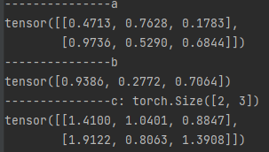

## Tensor的in-place操作

张量Tensor的in-place也称为**原地操作符**, 是指**改变tensor值的时候，不经过复制操作直接在原来的内存上改变其值**。请注意PyTorch操作inplace版本都有后缀"_", 例如y.add_(x),x.copy_(y),x.t_()，如`add_()、sub_()、mul_()`, relu_()等尾部带下划线的操作都称为in-place操作。

> 

```
import torch

x = torch.rand(5, 3)
x.add_(x) # adds x to y
print(y)
```

使用in-place操作可以节省一些GPU显存，因为它们不需要复制输入，但请注意：

1. `x=x+y` 与`x+=y`后者称为in-place操作，前者则不是。
2. 对于**requires_grad=True**的叶子张量(leaf tensor) 不能使用 inplace operation
3. 对于在**求梯度阶段需要用到的张量**不能使用 inplace operation


## Tensor的广播机制

**广播机制**是指：当两个tensor的shape或size不对齐的情况下，会自动进行扩展，并完成相应的运算。即张量参数可自动扩展大小。


**广播机制**要满足两个条件：

1. 每个张量至少有一个维度
2. 满足右对齐  - 张量的维度以右边来进行对齐

```python
# 两个张量分别是3维与1维
torch.rand(2,1,1) + torch.rand(3)

#. 补齐的条件：torch.rand(2,1,1)中最后一位为1或与torch.rand(3)中的'**3**'相同
#. 向右补齐方式：torch.rand(2,1,1) 中的最后一个1与torch.rand(3)中的3对齐，同时补齐torch.rand(3)的前两维补1，变为torch.rand(1,1,3)
torch.rand(2,1,1)
torch.rand(1,1,3)
```

**举例**

```python
import torch

# torch.rand(2, 1) 也是对的,引时c会是2 * 2的张量；但torch.rand(2, 2)是会报错。
a = torch.rand(2, 3) 
b = torch.rand(3)
# a , 2 * 3
# b , 1 * 3
# c , 2 * 3 -- 计算时将b的分别与a的两排数上相加
c = a + b
print("---------------a")
print(a)
print("---------------b")
print(b)
print("---------------c:", c.shape)
print(c)
```

输出




**复杂例子**：

```python
a = torch.rand(2,1,1,3)
b = torch.rand(4,2,3)
c = a + b
# a , 2 * 1 * 1 * 3
# b , 1 * 4 * 2 * 3
# c , 2 * 4  * 2 * 3 -- 计算时将b的分别与a的两排数上相加
c = a + b
print("---------------a")
print(a)
print("---------------b")
print(b)
print("---------------c:", c.shape)
print(c)
```


**应用**

当存在如下两个张量`a = torch.rand(2,2)`和`b = torch.rand(1,2)`，在没有广播机制时，需要先将b=torch.rand(1,2) 变成`2 * 2 `维再进行与a的相加减。现在有广播机制之后，a 和b可直接进行相加。

**广播机制同样适用于，减、乘、除等运算**


## Tensor的比较运算

- torch.eq(input,other, out=None)  # 按成员进行等式操作，相同返回True
- torch.ge(input, other, out=None) # input>= other
- torch.gt(input, other, out=None)   # input>other
- torch.le(input, other, out=None)   # input<=other
- torch.lt(input, other, out=None)    # input<other
- torch.ne(input, other, out=None)  # input != other 不等于
- torch.equal(tensor1,tensor2)        # **如果tensor1和tensor2有相同的size和elements，则为true**


## Tensor的排序-topk及-kthvalue

- torch.sort(input, dim=None, descending=False, out=None)   #对目标input进行排序
-  torch.topk(input, k, dim=None, largest=True, sorted=Trueout=None)   #沿着指定维度返回最大k个数值及其索引值
-  torch.kthvalue(input, k, dim=None, out=None)  #沿着指定维度返回第k个最小值及其索引值


