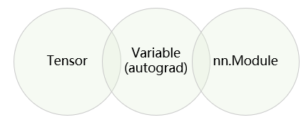

## PyTorch介绍


PyTorch是Facebook人工智能研究员(FAIR)于2017年在Github上开源，前身是Torch。Torch并非是用主流语言编写，考虑到AI行业主流语言与受众群体，factbook用Python对Torch框架进行重构，虽然pytorch有某些底层功能也用到了c/c++写的，但pytorch都给这些功能提供了python的接口，这样可以让程序员很方便的用python调用PyTorch整个框架的功能，以此来完成深度学习的模型搭建，并利用这些模型来解决实际问题。


**Pytorch vs ** **TensorFlow**

| **Pytorch**                                                  | **TensorFlow**                                               |
| ------------------------------------------------------------ | ------------------------------------------------------------ |
| 简洁（编程同Python几乎一致） <br>动态计算<br>visdom<br>部署不方便 | 接口复杂 <br/>静态图（TF2.0 Eager Execution已引入动态图）<br/>Tensorboard (现阶段PyTorch也引入了) <br/>部署方便(TF serving)<br/> |

> **什么是动态图与静态图**
>
> - 动态图: 编好程序即可执行，
>
> - 静态图: 先搭建计算图，后运行，允许编译器进行优化
>


**部署方式**

- Pytorch如果要做部署，需要用到Python的fastAPI等来完成部（也可直接用Starlette。FastAPI也是基于Starlette，适用于高并发）

- TensorFlow的TF serving直接完成部署，在资源调度上更好一些，在模型部署时比较好。

- 学习建议：时间足够的话，两者都学习；时间不够，学pytorch。


**torch编程**

> 编程与调试都比较简单

```python
import torch
A = torch.Tensor([0])
B = torch.Tensor([10])
while(A<B)[O]:
   A += 2
   B+=1
   print(A)
   print(B)
```

**TensorFlow编程:** 

> 静态图在编译时，可以被编译器进行一些优化操作; 代码编译复杂，调试不直观

```python
import tensorflow as tf
A = tf.constant(0)
B = tf.constant(10)
def cond(A, B,*args):
    return A < B

def body(A, B)
	A = tf.add(A, 2)
	B = tf.add(B 1)
	return A, B

c1, c2 = tf.while_loop(cond, body,[A,B])

with tf.Session() as sess:
	A res, B res = sess.run([c1, c2])

print(A res)
print(B res)
```


## 安装与搭建PyTorch的环境

笔者的文章：[Python+PyTorch+Anaconda安装配置](https://juejin.cn/post/7290494120207319092)


## 机器学习基础

[机器学习基础](https://blog.nianxi.cc/article/2348287028.html)


## PyTorch基本概念

三个基本概念：Tensor、Variable(autograd), nn.Module，如下图所示




### Tensor

[Tensor的基本概念](https://blog.nianxi.cc/article/2348287033.html)


### Variable (autograd)

变量在机器学习中是一个非常重要的概念，在我们的机器学习中，我们需要用变量来表达参数。在机器学习中，我们想要去求解的模型，刚开始模型参数是未知的，这些未知的参数就是**变量**。

### nn.Module

nn.Module用来解决计算机视觉等任务会用到一些网络结构，这些网络结构是搭建深度学习、模型所需要用到的一个个积木元素。


