## 蔓越莓椰蓉酥

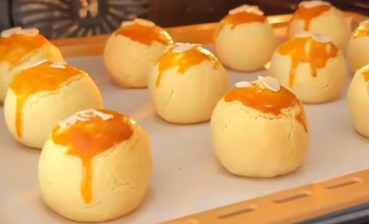

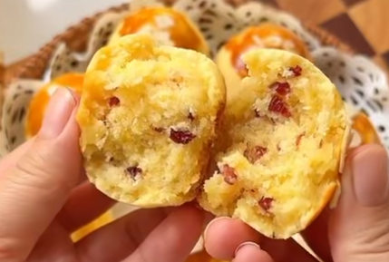

### 工具 - 玻璃碗、电动打蛋器或搅拌机、烤箱

### 椰蓉馅

- 食材：90g椰蓉、35g白糖、40g奶粉、1个鸡蛋、65g软化好的黄油或椰子油、40g蔓越莓碎

- 方法：

  - 将上述食材混合在一块，快速搅拌均匀；加入40g蔓越莓，再搅拌均匀
  
    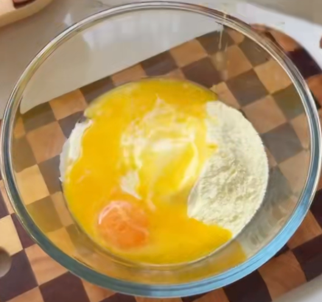
  
    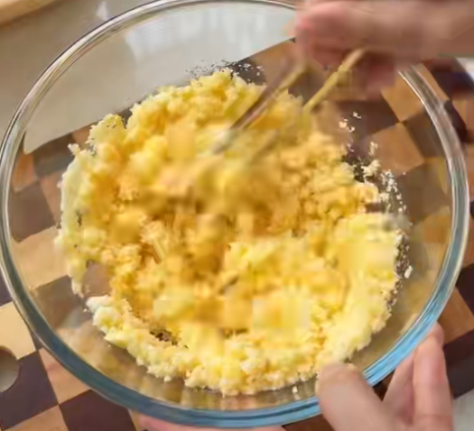
  
  - 按压平整后，放在冰箱冷藏20分钟后，分成12等分，戳成小圆球
  
    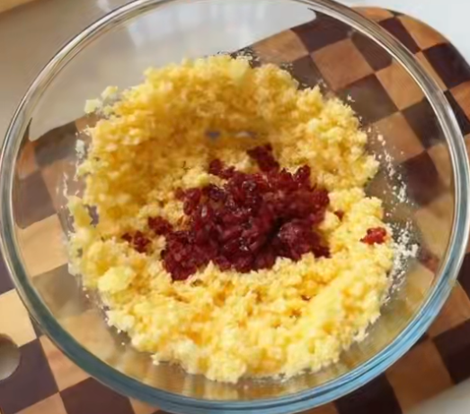
  
    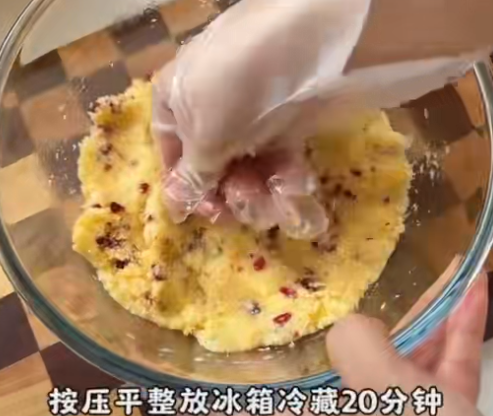
  
    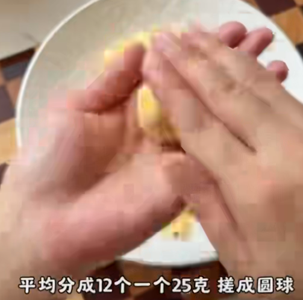
  
    

### 椰蓉皮
食材：100g软化好的黄油或椰子油、40g糖粉、1个鸡蛋、190g低筋面粉，20g奶粉
方法：

  1. 65g软化好的黄油或椰子油、40g糖粉 - 用打蛋器或或搅拌机 搅拌至发白

     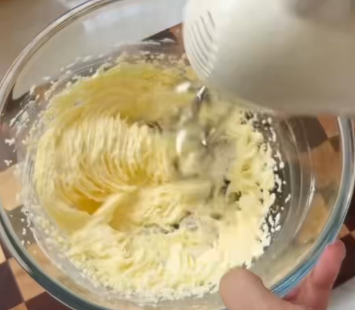

  2. 1个鸡蛋打碎，分两次加入，第一次加入一半并打拌均匀；

     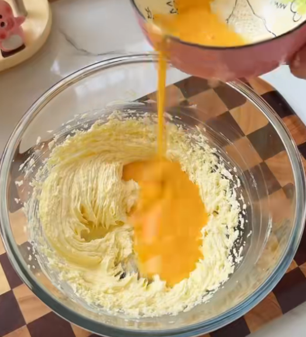

  3. 再将余下的蛋汁再次加入拌匀；打不到的地方用刮刀整理到中间拌均；

     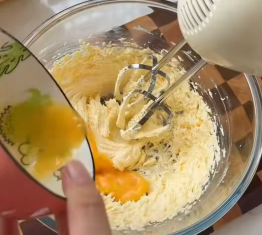

     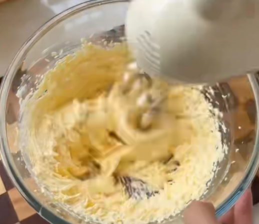

  4. 加主190g面粉，20g奶粉，揉面至均均匀，按压平整后平均分成12分

     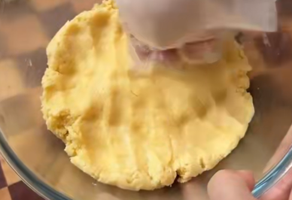

  5. 压成饼状即制作成皮；用制作好的皮包裹住椰蓉馅；

     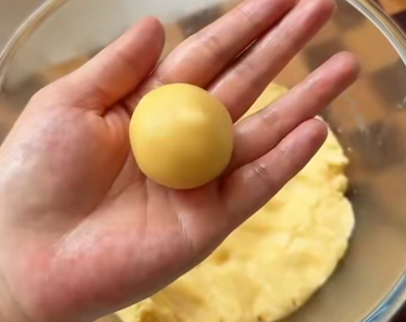

     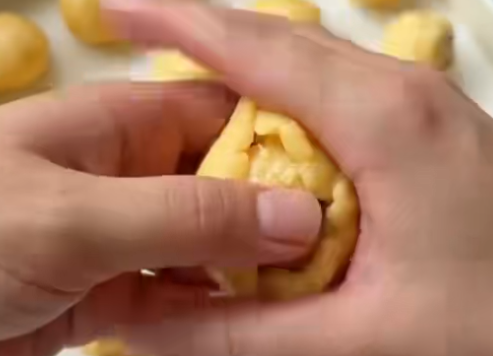

  6. 在顶部刷上蛋黄液，外加白芝麻或杏仁片作为装饰；

     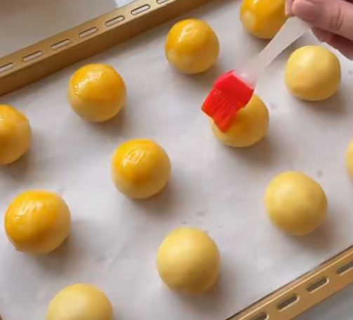

     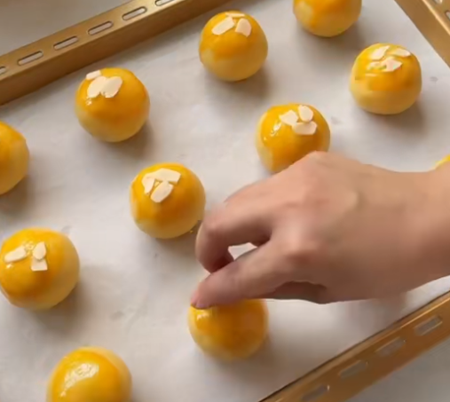

### 椰蓉酥烤制 - 放入预热好的烤箱（温度：170度，时间：25~30分钟）
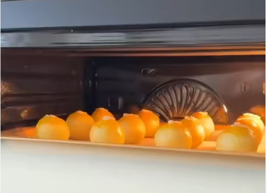

